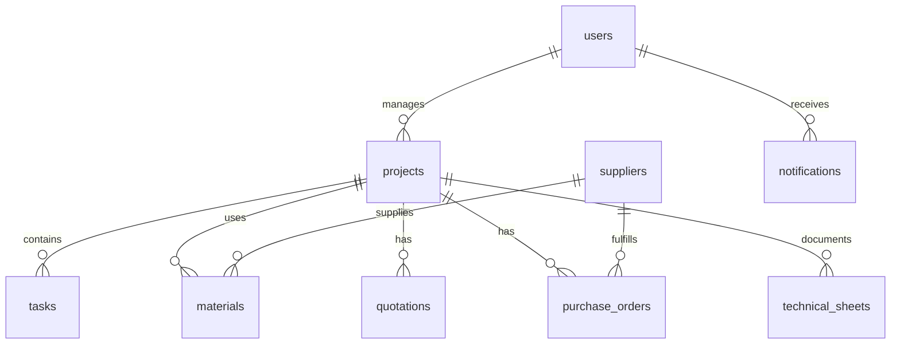

# SmartChantierAI — Database Schema

Source of truth: `supabase/migrations/001_core_schema.sql` and `002_technical_sheets_storage.sql`.

## Entity relationship (overview)

## Tables

### `users`

| Column | Type | Notes |
|--------|------|-------|
| id | uuid PK | References `auth.users` |
| email | text | Unique |
| display_name | text | |
| role | enum | admin, project_manager, site_manager, client |
| company_id | uuid | Optional multi-tenant |

### `projects`

| Column | Type | Notes |
|--------|------|-------|
| id | uuid PK | |
| name | text | Required |
| client_name, address, city | text | |
| budget_planned, budget_consumed | numeric | |
| progress | smallint | 0–100 |
| status | text | active, delayed, at_risk, completed |
| start_date, end_date | date | |
| created_by | uuid | FK users |

### `tasks`

| Column | Type | Notes |
|--------|------|-------|
| id | uuid PK | |
| project_id | uuid FK | CASCADE delete |
| title, description | text | |
| status, priority | text | |
| assignee_id | uuid | FK users |
| due_date | date | |

### `suppliers`

| Column | Type | Notes |
|--------|------|-------|
| id | uuid PK | |
| name | text | Required |
| category, phone, email, website, city | text | |
| rating | smallint | 0–100 |

### `materials`

| Column | Type | Notes |
|--------|------|-------|
| id | uuid PK | |
| project_id | uuid FK | Nullable |
| name, reference, brand | text | |
| quantity, unit_price_ht | numeric | |
| supplier_id | uuid FK | |

### `quotations` (devis)

| Column | Type | Notes |
|--------|------|-------|
| id | uuid PK | |
| project_id | uuid FK | |
| number | text | Unique business id |
| client_name, site_address, city | text | |
| subtotal_ht, tva_amount, total_ttc | numeric | |
| status | text | draft, sent, accepted, rejected |
| payload | jsonb | Full devis document |
| created_by | uuid | |

### `purchase_orders` (bons de commande)

| Column | Type | Notes |
|--------|------|-------|
| id | uuid PK | |
| project_id, supplier_id | uuid FK | |
| number | text | |
| total_ht, total_ttc | numeric | |
| status | text | |
| payload | jsonb | Lines, conditions |

### `technical_sheets`

| Column | Type | Notes |
|--------|------|-------|
| id | uuid PK | |
| project_id | uuid FK | |
| product_name, reference, brand, supplier | text | |
| payload | jsonb | Extracted OCR/IA fields |
| pdf_storage_path | text | Supabase Storage path |
| confidence | text | |

### `notifications`

| Column | Type | Notes |
|--------|------|-------|
| id | uuid PK | |
| user_id | uuid FK | |
| title, body | text | |
| type | text | delay, risk, material, system, … |
| read | boolean | |
| href | text | Deep link |
| metadata | jsonb | chantierId, level, auto-generated flag |

### `employees` (Phase 2)

| Column | Type | Notes |
|--------|------|-------|
| id | uuid PK | |
| name | text | |
| trade, role_type, team | text | |
| project_id | uuid FK | |
| active, hours_this_week | | |

### `attendance_records` (Phase 2)

| Column | Type | Notes |
|--------|------|-------|
| id | uuid PK | |
| employee_id, project_id | uuid FK | |
| work_date | date | |
| check_in, check_out | timestamptz | |
| present, absent, sick, leave | boolean | |
| hours_worked | numeric | |

### `site_photos` / `photo_albums` (Phase 2)

Photos stored in `site_photos` with optional `storage_path` (Supabase bucket `documents`). Albums keep `photo_ids` jsonb array.

## Application mapping

- UI `Chantier` ↔ `projects` via `src/services/saas/mappers.ts`
- Offline mode: `src/services/saas/localStore.ts` mirrors the same shape in localStorage

## RLS

Migrations enable RLS; policies tie rows to `auth.uid()` and role. Review policies before production launch.
